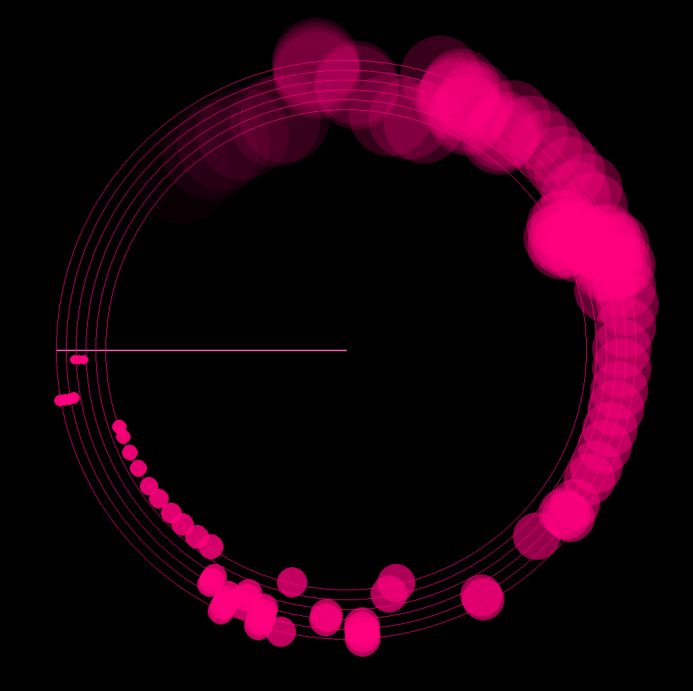

# Circle Dance

Visualization library and tool for music streams. Can either play and visualize a song or read from a sound device as steam input.

## Installation
`poetry install`

## Usage
- To play: `circle_dance play songs/song.mp3 --note-type=dot -t 0.75`
- To listen: `circle_dance play listen --note-type=sarc -t 0.9`

## Screenshot

